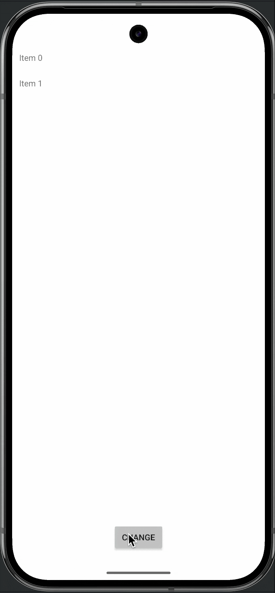

# irurueta-android-recycler-view-manager
Recycler view utility to simplify adapter notifications when collections of data are modified

[](https://github.com/albertoirurueta/irurueta-android-recycler-view-manager/actions)

[](https://sonarcloud.io/dashboard?id=albertoirurueta_irurueta-android-recycler-view-manager)
[](https://sonarcloud.io/dashboard?id=albertoirurueta_irurueta-android-recycler-view-manager)

[](https://sonarcloud.io/dashboard?id=albertoirurueta_irurueta-android-recycler-view-manager)
[](https://sonarcloud.io/dashboard?id=albertoirurueta_irurueta-android-recycler-view-manager)

[](https://sonarcloud.io/dashboard?id=albertoirurueta_irurueta-android-recycler-view-manager)
[](https://sonarcloud.io/dashboard?id=albertoirurueta_irurueta-android-recycler-view-manager)
[](https://sonarcloud.io/dashboard?id=albertoirurueta_irurueta-android-recycler-view-manager)

[](https://sonarcloud.io/dashboard?id=albertoirurueta_irurueta-android-recycler-view-manager)
[](https://sonarcloud.io/dashboard?id=albertoirurueta_irurueta-android-recycler-view-manager)
[](https://sonarcloud.io/dashboard?id=albertoirurueta_irurueta-android-recycler-view-manager)

[](https://search.maven.org/artifact/com.irurueta/irurueta-android-recycler-view-manager/1.0.0/aar)

[API Documentation](http://albertoirurueta.github.io/irurueta-android-recycler-view-manager)

## Overview

This library contains a utility class to simplify adapter notifications when collections of data
are modified.

The class can process a pair of collections of data and generate the necessary adapter notifications
when items are added, removed, moved or changed.



## Usage

Add the following dependency to your project:

```
implementation 'com.irurueta:irurueta-android-recycler-view-manager:1.0.4'
```

You can refer to the sample app for a complete example of how to use this library.

In summary, the following steps are required:
- Identify in your data model what identifies each item, and when it is considered that the content
  of an item has changed.
  For instance, if the following data model is used:
  ```
    data class Item(val id: Long, val name: String)
  ```
  The id field is used to identify each item, and the name field is used to determine if the content
  of an item has changed.
- Create a RecyclerView.Adapter and RecyclerView.ViewHolder as usual to inflate and update the
  contents of the views managed by the RecyclerView.
- Create a RecyclerViewManager that accepts the adapter and comparators to determine whether items
  in the data model are the same or their contents have changed.
  For instance:
  ```
    private val manager = RecyclerViewManager<ItemViewHolder, Item>(
        adapter,
        { item1, item2 -> item1.id == item2.id },
        { item1, item2 -> item1.name == item2.name }
    )
  ```
- Whenever your items change make sure that:
    - You recycler view adapter receives the new items (the getItemCount must return the number of
      new items).
    - You call the process method of the RecyclerViewManager with the new items and the old items.
      For instance:
      ```
        manager.process(newItems, oldItems)
      ```
      This will generate all the required adapter notifications to reflect the changes in the
      RecyclerView.